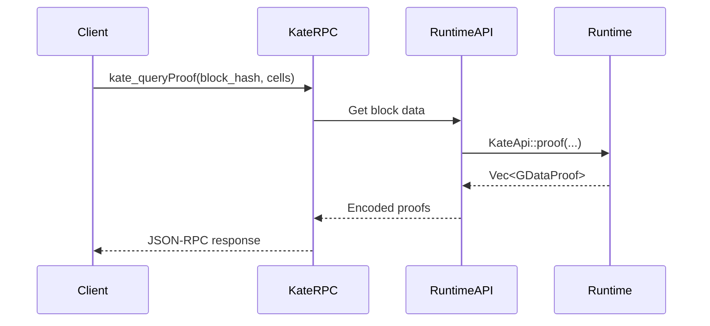

The `KateApi` runtime API provides methods for generating Kate polynomial commitments (KZG commitments) and cryptographic proofs for data availability. These proofs enable light clients to verify that block data is available without downloading entire blocks.

## Overview

Kate commitments are the foundation of Avail's data availability layer:

- **Polynomial Commitments**: Each row of the data matrix is committed using KZG (Kate-Zaverucha-Goldberg) commitments over BLS12-381
- **Efficient Proofs**: Generate proofs for individual cells or blocks of cells
- **Light Client Sampling**: Enable probabilistic verification with minimal data
- **Erasure Coding**: Support 2x redundancy for data reconstruction

### Runtime APIs vs RPC Endpoints

<Info>
**Runtime APIs** execute inside the runtime (WebAssembly) with direct state access and deterministic execution. **RPC Endpoints** run in the node client and may call runtime APIs internally to serve requests over the network.

The `KateApi` runtime API is called by the Kate RPC service to generate proofs on demand.
</Info>

## API Definition

Defined in `runtime/src/apis.rs:68-73`:

```rust
pub trait KateApi {
    fn data_proof(block_number: u32, extrinsics: Vec<OpaqueExtrinsic>, tx_idx: u32) -> Option<ProofResponse>;
    fn rows(block_number: u32, extrinsics: Vec<OpaqueExtrinsic>, block_len: BlockLength, rows: Vec<u32>) -> Result<Vec<GRow>, RTKateError>;
    fn proof(block_number: u32, extrinsics: Vec<OpaqueExtrinsic>, block_len: BlockLength, cells: Vec<(u32,u32)>) -> Result<Vec<GDataProof>, RTKateError>;
    fn multiproof(block_number: u32, extrinsics: Vec<OpaqueExtrinsic>, block_len: BlockLength, cells: Vec<(u32,u32)>) -> Result<Vec<(GMultiProof, GCellBlock)>, RTKateError>;
}
```

## Methods

### data_proof

Generates a Merkle proof for a specific transaction within a block, proving its inclusion in the data root.

```rust
fn data_proof(
    block_number: u32,
    extrinsics: Vec<OpaqueExtrinsic>,
    tx_idx: u32
) -> Option<ProofResponse>;
```

<ParamField path="block_number" type="u32" required>
  Block number for seed generation and row assignment.
</ParamField>

<ParamField path="extrinsics" type="Vec<OpaqueExtrinsic>" required>
  Complete list of extrinsics (transactions) in the block.
</ParamField>

<ParamField path="tx_idx" type="u32" required>
  Index of the transaction to prove (0-based).
</ParamField>

<ParamField path="return" type="Option<ProofResponse>">
  Proof response containing the Merkle proof and optional bridge message, or `None` if the transaction index is invalid.
</ParamField>

#### Return Type: ProofResponse

<ResponseField name="data_proof" type="DataProof" required>
  The Merkle proof structure.
  
  <Expandable title="properties">
    <ResponseField name="sub_trie" type="SubTrie">
      Identifies which Merkle subtrie the data belongs to:
      - `DataSubmit`: Regular `submit_data` transactions
      - `Bridge`: Bridge-related messages
    </ResponseField>
    
    <ResponseField name="roots" type="object">
      Merkle roots for both subtries.
      
      <Expandable title="properties">
        <ResponseField name="data_root" type="H256">
          Root hash of the data submit subtrie.
        </ResponseField>
        
        <ResponseField name="bridge_root" type="H256">
          Root hash of the bridge message subtrie.
        </ResponseField>
      </Expandable>
    </ResponseField>
    
    <ResponseField name="proof" type="Vec<H256>">
      Array of Merkle proof hashes forming the path from leaf to root.
    </ResponseField>
    
    <ResponseField name="leaf_index" type="u32">
      Position of the transaction's leaf in the Merkle tree.
    </ResponseField>
  </Expandable>
</ResponseField>

<ResponseField name="message" type="Option<BridgeMessage>">
  Bridge message data, present only if `sub_trie` is `Bridge`.
</ResponseField>

#### Usage Example

```rust
use sp_api::ProvideRuntimeApi;
use avail_runtime::KateApi;

let api = client.runtime_api();
let block_hash = client.info().best_hash;

// Get block data
let block = client.block(block_hash)?.unwrap();
let extrinsics = block.block.extrinsics;
let block_number = block.block.header.number;

// Generate proof for transaction at index 5
let proof_response = api.data_proof(
    block_hash,
    block_number,
    extrinsics.clone(),
    5  // tx_idx
)?;

if let Some(proof) = proof_response {
    println!("Leaf index: {}", proof.data_proof.leaf_index);
    println!("Proof length: {} hashes", proof.data_proof.proof.len());
}
```

### rows

Returns the raw data for specific rows of the erasure-coded matrix.

```rust
fn rows(
    block_number: u32,
    extrinsics: Vec<OpaqueExtrinsic>,
    block_len: BlockLength,
    rows: Vec<u32>
) -> Result<Vec<GRow>, RTKateError>;
```

<ParamField path="block_number" type="u32" required>
  Block number for deterministic row assignment.
</ParamField>

<ParamField path="extrinsics" type="Vec<OpaqueExtrinsic>" required>
  Complete list of extrinsics in the block.
</ParamField>

<ParamField path="block_len" type="BlockLength" required>
  Block dimensions and configuration (from `DataAvailApi::block_length()`).
</ParamField>

<ParamField path="rows" type="Vec<u32>" required>
  Array of row indices to retrieve (0-based).
</ParamField>

<ParamField path="return" type="Result<Vec<GRow>, RTKateError>">
  Array of rows, where each `GRow` is `Vec<U256>` containing the scalar field elements.
</ParamField>

#### Return Type: GRow

```rust
// Defined in runtime/src/kate/mod.rs:22-23
pub type GRawScalar = U256;
pub type GRow = Vec<GRawScalar>;
```

Each row is a vector of 256-bit scalars representing cells in the matrix:
- **Length**: Equal to `block_len.cols.0 × 2` (due to 2x erasure coding extension)
- **Element**: U256 scalar field element from BLS12-381
- **Usage**: Raw data for reconstruction or direct cell access

<Warning>
Row data includes both original cells (first 50%) and erasure-coded extended cells (second 50%). Only 50% of cells are needed to reconstruct the full row.
</Warning>

#### Implementation

Implementation in `runtime/src/apis.rs:476-481`:

```rust
fn rows(block_number: u32, extrinsics: Vec<OpaqueExtrinsic>, block_len: BlockLength, rows: Vec<u32>) -> Result<Vec<GRow>, RTKateError> {
    let app_extrinsics = HeaderExtensionBuilderData::from_opaque_extrinsics::<RTExtractor>(block_number, &extrinsics).to_app_extrinsics();
    let grid_rows = super::kate::grid::<Runtime>(app_extrinsics, block_len, rows)?;
    log::trace!(target: LOG_TARGET, "KateApi::rows: rows={grid_rows:#?}");
    Ok(grid_rows)
}
```

### proof

Generates Kate polynomial commitment proofs for specific cells in the matrix.

```rust
fn proof(
    block_number: u32,
    extrinsics: Vec<OpaqueExtrinsic>,
    block_len: BlockLength,
    cells: Vec<(u32, u32)>
) -> Result<Vec<GDataProof>, RTKateError>;
```

<ParamField path="block_number" type="u32" required>
  Block number for deterministic matrix construction.
</ParamField>

<ParamField path="extrinsics" type="Vec<OpaqueExtrinsic>" required>
  Complete list of extrinsics in the block.
</ParamField>

<ParamField path="block_len" type="BlockLength" required>
  Block dimensions and configuration.
</ParamField>

<ParamField path="cells" type="Vec<(u32, u32)>" required>
  Array of cell coordinates to prove, as `(row, col)` tuples.
</ParamField>

<ParamField path="return" type="Result<Vec<GDataProof>, RTKateError>">
  Array of proofs, one for each requested cell.
</ParamField>

#### Return Type: GDataProof

```rust
// Defined in runtime/src/kate/mod.rs:24
pub type GDataProof = (GRawScalar, GProof);
```

<ResponseField name="0" type="GRawScalar (U256)" required>
  The cell's value as a 256-bit scalar field element.
</ResponseField>

<ResponseField name="1" type="GProof" required>
  The Kate commitment proof (48 bytes).
  
  This is a KZG proof that can be verified against the row commitment in the block header using elliptic curve pairings.
</ResponseField>

#### Proof Structure

```rust
// Defined in runtime/src/kate/mod.rs:53
pub struct GProof([u8; 48]);
```

The 48-byte proof is a compressed BLS12-381 G1 point that proves:
```
P(x) - P(i)
───────────  · G
   x - i
```

Where:
- `P(x)` is the row polynomial
- `i` is the cell position
- `P(i)` is the cell value
- `G` is the generator point

#### Usage Example

```rust
let cells = vec![
    (0, 0),    // Top-left cell
    (0, 1),    // Next cell in first row
    (1, 0),    // First cell in second row
];

let proofs = api.proof(
    block_hash,
    block_number,
    extrinsics.clone(),
    block_len,
    cells
)?;

for (i, (value, proof)) in proofs.iter().enumerate() {
    println!("Cell {}: value={}, proof_len={}", 
        i, value, proof.0.len()
    );
}
```

### multiproof

Generates efficient multiproofs that prove multiple cells with a single cryptographic proof.

```rust
fn multiproof(
    block_number: u32,
    extrinsics: Vec<OpaqueExtrinsic>,
    block_len: BlockLength,
    cells: Vec<(u32, u32)>
) -> Result<Vec<(GMultiProof, GCellBlock)>, RTKateError>;
```

<ParamField path="block_number" type="u32" required>
  Block number for deterministic matrix construction.
</ParamField>

<ParamField path="extrinsics" type="Vec<OpaqueExtrinsic>" required>
  Complete list of extrinsics in the block.
</ParamField>

<ParamField path="block_len" type="BlockLength" required>
  Block dimensions and configuration.
</ParamField>

<ParamField path="cells" type="Vec<(u32, u32)>" required>
  Array of cell coordinates to prove. Cells are grouped into rectangular blocks.
</ParamField>

<ParamField path="return" type="Result<Vec<(GMultiProof, GCellBlock)>, RTKateError>">
  Array of multiproof tuples, where each tuple contains the proof data and cell block bounds.
</ParamField>

#### Return Type: GMultiProof

```rust
// Defined in runtime/src/kate/mod.rs:25
pub type GMultiProof = (Vec<GRawScalar>, GProof);
```

<ResponseField name="0" type="Vec<GRawScalar>" required>
  Array of cell values in the rectangular block (typically 16×64 = 1,024 cells).
</ResponseField>

<ResponseField name="1" type="GProof" required>
  Single 48-byte Kate proof that verifies all cells in the block.
</ResponseField>

#### Cell Block Bounds: GCellBlock

```rust
// Defined in runtime/src/kate/mod.rs:28-33
pub struct GCellBlock {
    pub start_x: u32,
    pub start_y: u32,
    pub end_x: u32,
    pub end_y: u32,
}
```

<ResponseField name="start_x" type="u32" required>
  Starting column index (inclusive).
</ResponseField>

<ResponseField name="start_y" type="u32" required>
  Starting row index (inclusive).
</ResponseField>

<ResponseField name="end_x" type="u32" required>
  Ending column index (exclusive).
</ResponseField>

<ResponseField name="end_y" type="u32" required>
  Ending row index (exclusive).
</ResponseField>

#### Efficiency Comparison

<Tabs>
  <Tab title="Single Cell Proofs">
    **1,024 cells using `proof()`:**
    
    - Proof data: 1,024 × (32 + 48) = 81,920 bytes
    - Verification: 1,024 pairing checks
    - Generation time: ~1-5ms per proof = ~5 seconds total
  </Tab>
  
  <Tab title="Multiproof">
    **1,024 cells using `multiproof()`:**
    
    - Proof data: (1,024 × 32) + 48 = 32,816 bytes
    - Verification: 1 pairing check
    - Generation time: ~50-100ms total
    
    **Savings**: 60% smaller, 1024× faster verification, 50× faster generation
  </Tab>
</Tabs>

<Tip>
Use `multiproof()` when retrieving app-specific data or downloading multiple cells. It's significantly more efficient than individual proofs.
</Tip>

#### Implementation

Implementation in `runtime/src/apis.rs:490-495`:

```rust
fn multiproof(block_number: u32, extrinsics: Vec<OpaqueExtrinsic>, block_len: BlockLength, cells: Vec<(u32,u32)>) -> Result<Vec<(GMultiProof, GCellBlock)>, RTKateError> {
    let app_extrinsics = HeaderExtensionBuilderData::from_opaque_extrinsics::<RTExtractor>(block_number, &extrinsics).to_app_extrinsics();
    let data_proofs = super::kate::multiproof::<Runtime>(app_extrinsics, block_len, cells)?;
    log::trace!(target: LOG_TARGET, "KateApi::proof: data_proofs={data_proofs:#?}");
    Ok(data_proofs)
}
```

## Error Handling

All methods (except `data_proof`) return `Result<T, RTKateError>` where `RTKateError` is defined in `runtime/src/kate/mod.rs:74-94`:

```rust
pub enum Error {
    TryFromInt,              // Invalid integer conversion
    MissingRow(u32),         // Requested row doesn't exist
    InvalidScalarAtRow(u32), // Invalid scalar field element
    KateGrid,                // Grid generation error
    InvalidDimension,        // Invalid matrix dimensions
    AppRow,                  // App data row error
    MissingCell { row: u32, col: u32 }, // Requested cell doesn't exist
    Proof,                   // Proof generation error
    ColumnExtension,         // Failed to extend columns (erasure coding)
}
```

### Common Errors

<AccordionGroup>
  <Accordion title="MissingCell">
    **Cause**: Requested cell coordinates are out of bounds.
    
    **Solution**: Ensure `row < block_len.rows.0` and `col < block_len.cols.0 × 2` (accounting for 2x extension).
  </Accordion>
  
  <Accordion title="MissingRow">
    **Cause**: Requested row index exceeds matrix height.
    
    **Solution**: Verify row indices are less than `block_len.rows.0`.
  </Accordion>
  
  <Accordion title="ColumnExtension">
    **Cause**: Erasure coding extension failed, typically due to invalid matrix dimensions.
    
    **Solution**: Ensure block dimensions are powers of 2 and within valid bounds.
  </Accordion>
  
  <Accordion title="KateGrid">
    **Cause**: Grid construction failed, possibly due to malformed extrinsics or configuration.
    
    **Solution**: Verify extrinsics are valid and block_len configuration is correct.
  </Accordion>
</AccordionGroup>

## Kate Commitment Process

The Kate API methods follow this pipeline:

<Steps>
  <Step title="Extract App Extrinsics">
    Convert opaque extrinsics to typed app extrinsics with AppId metadata.
    
    ```rust
    let app_extrinsics = HeaderExtensionBuilderData::from_opaque_extrinsics::<RTExtractor>(
        block_number,
        &extrinsics
    ).to_app_extrinsics();
    ```
  </Step>
  
  <Step title="Build Matrix Grid">
    Arrange extrinsics into a 2D matrix based on block dimensions.
    
    ```rust
    let grid = EGrid::from_extrinsics(
        app_extrinsics,
        MIN_WIDTH,
        max_width,
        max_height,
        seed  // Derived from block_number
    )?;
    ```
  </Step>
  
  <Step title="Apply Erasure Coding">
    Extend the matrix by 2x in the column dimension using Reed-Solomon encoding.
    
    ```rust
    let extended_grid = grid.extend_columns(
        NonZeroU16::new(2).expect("2>0")
    )?;
    ```
  </Step>
  
  <Step title="Create Polynomial Grid">
    Interpolate each row as a polynomial over the scalar field.
    
    ```rust
    let poly_grid = extended_grid.make_polynomial_grid()?;
    ```
  </Step>
  
  <Step title="Generate Proofs">
    Compute KZG commitments and proofs using the SRS (Structured Reference String).
    
    ```rust
    let proof = poly_grid.proof(srs, &cell)?;
    // or
    let multiproof = poly_grid.multiproof(srs, &cell, &grid, target_dims)?;
    ```
  </Step>
</Steps>

## Performance Characteristics

### Proof Generation

| Method | Input Size | Generation Time | Proof Size | Verification Time |
|--------|-----------|-----------------|------------|------------------|
| `data_proof` | 1 tx | ~1-5ms | ~500 bytes | ~2-5ms |
| `proof` (single) | 1 cell | ~1-5ms | 80 bytes | ~2-10ms |
| `proof` (100 cells) | 100 cells | ~100-500ms | 8 KB | ~200ms-1s |
| `multiproof` (1024 cells) | 1024 cells | ~50-100ms | ~33 KB | ~5-15ms |
| `rows` | 1 row | ~1-5ms | ~16-64 KB | N/A |

<Note>
Generation times vary based on block size, hardware, and matrix dimensions. Multiproof generation is parallelized for improved performance.
</Note>

## Integration with Kate RPC

The Kate RPC service calls these runtime APIs to serve proof requests:



See the [Kate RPC documentation](/api/kate/overview) for client-facing endpoints.

## Related Resources

<CardGroup cols={2}>
  <Card title="DataAvailApi" icon="chart-simple" href="/api/runtime/data-avail-api">
    Query block dimensions required for Kate API calls.
  </Card>
  
  <Card title="Kate RPC" icon="server" href="/api/kate/overview">
    RPC endpoints that use this runtime API.
  </Card>
  
  <Card title="Data Availability" icon="database" href="/architecture/data-availability">
    Learn how Kate commitments enable light client sampling.
  </Card>
  
  <Card title="Runtime Architecture" icon="cube" href="/architecture/runtime">
    Understanding the runtime structure and APIs.
  </Card>
</CardGroup>

## Advanced Topics

<AccordionGroup>
  <Accordion title="Application-Specific Data Retrieval">
    Clients can retrieve only their app's data by:
    
    1. Query block header to get AppId row mappings
    2. Use `rows()` to fetch only relevant rows
    3. Use `multiproof()` for efficient verification
    
    This enables bandwidth-efficient data retrieval for rollups and modular chains using Avail.
  </Accordion>
  
  <Accordion title="Light Client Sampling Strategy">
    Light clients should:
    
    1. Randomly select 15-20 cells per block
    2. Call `proof()` for selected cells
    3. Verify proofs against header commitments
    4. Calculate confidence: `1 - (0.5)^k` where k = successful samples
    
    With 20 samples, confidence exceeds 99.9999% that >50% of data is available.
  </Accordion>
  
  <Accordion title="Trusted Setup (SRS)">
    The Kate commitment system requires a Structured Reference String (SRS) from a trusted setup:
    
    ```rust
    let srs = SRS.get_or_init(multiproof_params);
    ```
    
    The SRS is generated once and used for all blocks. It must support the maximum matrix dimensions (1024×1024×2).
  </Accordion>
</AccordionGroup>
