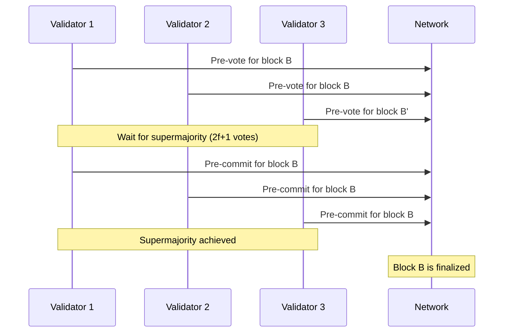

Avail uses a hybrid consensus mechanism inherited from Substrate, combining **BABE** (Blind Assignment for Blockchain Extension) for block production with **GRANDPA** (GHOST-based Recursive Ancestor Deriving Prefix Agreement) for finality.

## Two-Layer Consensus

The separation of block production and finality provides several advantages:

- **Performance**: Block production can happen quickly while finality happens asynchronously
- **Safety**: Probabilistic finality (longest chain) is supplemented with deterministic finality
- **Network Resilience**: Can tolerate different types of network partitions


## BABE (Block Production)

### Overview

BABE is a slot-based block production mechanism where time is divided into epochs, and epochs are divided into slots.

<Info>
**Slot Duration**: 20 seconds (`runtime/src/constants.rs`)  
**Epoch Duration**: 4 hours (720 slots)  
**Primary Probability**: Validators have a probability-based chance to produce a block in each slot
</Info>

### Configuration

The BABE pallet configuration in `runtime/src/lib.rs`:

```rust runtime/src/lib.rs
impl pallet_babe::Config for Runtime {
    type EpochDuration = EpochDuration;
    type ExpectedBlockTime = ExpectedBlockTime;
    type EpochChangeTrigger = pallet_babe::ExternalTrigger;
    
    type DisabledValidators = Session;
    type WeightInfo = ();
    type MaxAuthorities = MaxAuthorities;
    type MaxNominators = MaxNominatorRewardedPerValidator;
    
    type KeyOwnerProof = <Historical as KeyOwnerProofSystem<_>>::Proof;
    type EquivocationReportSystem = pallet_babe::EquivocationReportSystem<
        Self,
        Offences,
        Historical,
        ReportLongevity,
    >;
}
```

### Block Production Process

<Steps>
  <Step title="Slot Selection">
    At the beginning of each slot (every 20 seconds), each validator runs a VRF (Verifiable Random Function) to determine if they are a slot leader.
    
    ```rust
    // VRF output determines block authorship
    let is_slot_leader = vrf_output < threshold;
    ```
  </Step>

  <Step title="Block Authorship">
    If selected as slot leader:
    1. Collect transactions from the mempool
    2. Execute transactions and build block body
    3. Generate Kate commitments for data availability
    4. Create block header with extension
    5. Sign block with validator key
  </Step>

  <Step title="Block Broadcasting">
    The produced block is broadcast to the network. Other nodes verify:
    - VRF proof is valid
    - Block signature is correct
    - Header extension (Kate commitment) is valid
    - All transactions are valid
  </Step>

  <Step title="Fork Choice">
    Nodes follow the longest chain rule for unfinalized blocks, switching to chains with more accumulated weight.
  </Step>
</Steps>

### Epoch Transitions

At the end of each epoch, BABE triggers an epoch change:

```rust
type EpochChangeTrigger = pallet_babe::ExternalTrigger;
```

This allows the runtime to:
- Update the active validator set from the Session pallet
- Rotate randomness for VRF computations
- Adjust epoch parameters if needed

<Note>
BABE's VRF-based selection ensures unpredictable, fair block production while preventing validator grinding attacks.
</Note>

### Primary vs Secondary Slots

BABE uses two slot types:

<Tabs>
  <Tab title="Primary Slots">
    **VRF-Based Selection**
    
    - Validators run VRF to determine eligibility
    - Provides unpredictability and fairness
    - Multiple validators may be selected (rare)
    - Prevents grinding attacks
  </Tab>

  <Tab title="Secondary Slots">
    **Round-Robin Fallback**
    
    - Used when no primary slot leader is selected
    - Validators take turns in a predetermined order
    - Ensures consistent block production
    - Lower priority than primary blocks
  </Tab>
</Tabs>

## GRANDPA (Finality)

### Overview

GRANDPA is a Byzantine fault-tolerant finality gadget that finalizes chains rather than individual blocks. It can finalize multiple blocks in a single round of voting.

### Key Properties

<CardGroup cols={2}>
  <Card title="Asynchronous" icon="clock">
    Finality votes happen independently of block production
  </Card>
  <Card title="Chain Finalization" icon="link">
    Votes finalize chains, not individual blocks
  </Card>
  <Card title="Accountable Safety" icon="shield">
    Byzantine validators can be identified and slashed
  </Card>
  <Card title="Dynamic Validator Sets" icon="users">
    Handles validator set changes gracefully
  </Card>
</CardGroup>

### Configuration

```rust runtime/src/lib.rs
impl pallet_grandpa::Config for Runtime {
    type RuntimeEvent = RuntimeEvent;
    type WeightInfo = ();
    type MaxAuthorities = MaxAuthorities;
    type MaxNominators = MaxNominatorRewardedPerValidator;
    type MaxSetIdSessionEntries = ConstU64<0>;
    
    type KeyOwnerProof = <Historical as KeyOwnerProofSystem<_>>::Proof;
    type EquivocationReportSystem = pallet_grandpa::EquivocationReportSystem<
        Self,
        Offences,
        Historical,
        ReportLongevity,
    >;
}
```

### Voting Process



<Steps>
  <Step title="Round Initialization">
    GRANDPA validators begin a voting round by observing the current best unfinalized block.
  </Step>

  <Step title="Pre-Vote Phase">
    Each validator broadcasts a **pre-vote** for the highest block they consider valid.
    
    - Validators collect pre-votes from other validators
    - Once >2/3 pre-votes are received for a chain, move to pre-commit
  </Step>

  <Step title="Pre-Commit Phase">
    Validators broadcast a **pre-commit** vote for the highest block that:
    - Has >2/3 pre-votes in its ancestry
    - They consider final
    
    This is the GHOST (Greedy Heaviest Observed SubTree) rule.
  </Step>

  <Step title="Finalization">
    When >2/3 of validators pre-commit to a block B:
    - Block B and all its ancestors are finalized
    - The finalized block is irreversible
    - A new round begins for subsequent blocks
  </Step>
</Steps>

### GHOST Rule

GRANDPA uses the GHOST rule to select which block to finalize:

```
Given a set of votes, find the block B such that:
1. B has >2/3 of the vote weight in its ancestry
2. B is the highest (most recent) such block
```

This allows GRANDPA to skip blocks and finalize chains efficiently.

<Accordion title="Example: Chain Finalization">
  ```
  Genesis -> A -> B -> C -> D -> E -> F
                   |
                   +-> C' -> D'
  ```
  
  If >2/3 of validators vote for block E:
  - GRANDPA finalizes the entire chain: Genesis -> A -> B -> C -> D -> E
  - The fork at C' is permanently rejected
  - Next round will vote on blocks after E
</Accordion>

## Authority Selection

Both BABE and GRANDPA authorities are selected through the Staking pallet.

### Session Management

The Session pallet (`runtime/src/lib.rs:11`) manages validator set rotations:

```rust
impl pallet_session::Config for Runtime {
    type RuntimeEvent = RuntimeEvent;
    type ValidatorId = AccountId;
    type ValidatorIdOf = pallet_staking::StashOf<Self>;
    type ShouldEndSession = Babe;
    type NextSessionRotation = Babe;
    type SessionManager = pallet_session::historical::NoteHistoricalRoot<Self, Staking>;
    type SessionHandler = <SessionKeys as OpaqueKeys>::KeyTypeIdProviders;
    type Keys = SessionKeys;
    type WeightInfo = pallet_session::weights::SubstrateWeight<Runtime>;
}
```

### Session Keys

Validators register multiple keys for different roles:

```rust runtime/src/primitives.rs
pub struct SessionKeys {
    pub babe: BabeId,            // For BABE block production
    pub grandpa: GrandpaId,      // For GRANDPA finality voting
    pub im_online: ImOnlineId,   // For heartbeat messages
    pub authority_discovery: AuthorityDiscoveryId, // For P2P discovery
}
```

## Equivocation Handling

Both BABE and GRANDPA implement equivocation (double-voting) detection and slashing.

### BABE Equivocation

**Equivocation**: Producing two different blocks in the same slot with the same VRF output.

```rust
type EquivocationReportSystem = pallet_babe::EquivocationReportSystem<
    Self,
    Offences,      // Records offences
    Historical,    // Provides historical key ownership proofs
    ReportLongevity,
>;
```

### GRANDPA Equivocation

**Equivocation**: Casting conflicting votes in the same round (e.g., pre-voting for two incompatible blocks).

```rust
type EquivocationReportSystem = pallet_grandpa::EquivocationReportSystem<
    Self,
    Offences,
    Historical,
    ReportLongevity,
>;
```

<Warning>
Validators who equivocate are slashed through the Staking pallet's slashing mechanism, losing a portion of their staked tokens.
</Warning>

## Validator Heartbeats

The ImOnline pallet (`runtime/src/lib.rs:20`) ensures validators are online and participating.

```rust
impl pallet_im_online::Config for Runtime {
    type AuthorityId = ImOnlineId;
    type RuntimeEvent = RuntimeEvent;
    type NextSessionRotation = Babe;
    type ValidatorSet = Historical;
    type ReportUnresponsiveness = Offences;
    type UnsignedPriority = ImOnlineUnsignedPriority;
    type WeightInfo = pallet_im_online::weights::SubstrateWeight<Runtime>;
    type MaxKeys = MaxKeys;
    type MaxPeerInHeartbeat = MaxPeerInHeartbeat;
}
```

Validators send heartbeat transactions every session. Failure to send heartbeats results in:
- Being marked as offline
- Reduced staking rewards
- Potential removal from the active validator set

## Authority Discovery

The AuthorityDiscovery pallet (`runtime/src/lib.rs:21`) enables validators to discover each other's network addresses.

```rust
impl pallet_authority_discovery::Config for Runtime {
    type MaxAuthorities = MaxAuthorities;
}
```

This is critical for:
- GRANDPA voting (validators need direct connections)
- Network optimization
- Reducing message propagation latency

## Block Import with Data Availability

Avail extends the standard Substrate block import with DA verification (`node/src/da_block_import.rs:126-148`):

```rust node/src/da_block_import.rs
async fn import_block(
    &mut self,
    block: BlockImportParams<B>,
) -> Result<ImportResult, Self::Error> {
    let is_own = matches!(block.origin, BlockOrigin::Own);
    let is_sync = matches!(
        block.origin,
        BlockOrigin::NetworkInitialSync | BlockOrigin::File
    );
    
    // Only verify DA for non-own, non-sync blocks
    if !is_own && !skip_sync && !block.with_state() {
        self.ensure_last_extrinsic_is_failed_send_message_txs(&block)?;
        self.ensure_valid_header_extension(&block)?;
    }
    
    // Pass to inner block import (BABE/GRANDPA)
    self.inner.import_block(block).await
}
```

### DA Verification Steps

<Steps>
  <Step title="Post-Inherent Check">
    Verifies the last extrinsic is a post-inherent transaction required by the Vector pallet.
  </Step>

  <Step title="Extension Verification">
    Recalculates the Kate commitment from block extrinsics and compares to the header extension.
    
    ```rust
    let data_root = api.build_data_root(parent_hash, block_number, extrinsics());
    let extension = api.build_extension(parent_hash, extrinsics(), data_root, block_len, block_number);
    
    ensure!(block.header.extension == extension, extension_mismatch());
    ```
  </Step>

  <Step title="Consensus Import">
    If DA checks pass, block is passed to BABE/GRANDPA for consensus verification.
  </Step>
</Steps>

<Info>
This DA block import layer ensures that blocks without valid Kate commitments are rejected before reaching consensus, providing cryptographic proof of data availability.
</Info>

## Performance Characteristics

### Block Production

- **Target Block Time**: 20 seconds
- **Actual Block Time**: May vary based on network conditions and validator selection
- **Empty Slots**: Possible if no validator is selected (primary) and secondary is skipped

### Finality

- **Expected Finality Time**: 1-2 blocks (~20-40 seconds) under normal conditions
- **Finality Lag**: Can increase during network partitions or high latency
- **Batch Finalization**: GRANDPA can finalize hundreds of blocks in a single round during sync

## Fork Handling

<Tabs>
  <Tab title="Short-Range Forks">
    **Handled by BABE**
    
    - Natural forks occur when multiple validators are selected for the same slot
    - Nodes follow the longest chain
    - GRANDPA eventually finalizes one fork, orphaning others
  </Tab>

  <Tab title="Long-Range Forks">
    **Prevented by GRANDPA**
    
    - Once a block is finalized, it cannot be reverted
    - Prevents long-range attacks from old validator sets
    - Checkpointing ensures new nodes sync to the correct chain
  </Tab>
</Tabs>

## Next Steps

<CardGroup cols={2}>
  <Card title="Data Availability" icon="database" href="/architecture/data-availability">
    Learn how Kate commitments provide DA guarantees
  </Card>
  <Card title="Runtime Architecture" icon="cube" href="/architecture/runtime">
    Explore runtime pallets and transaction flow
  </Card>
</CardGroup>