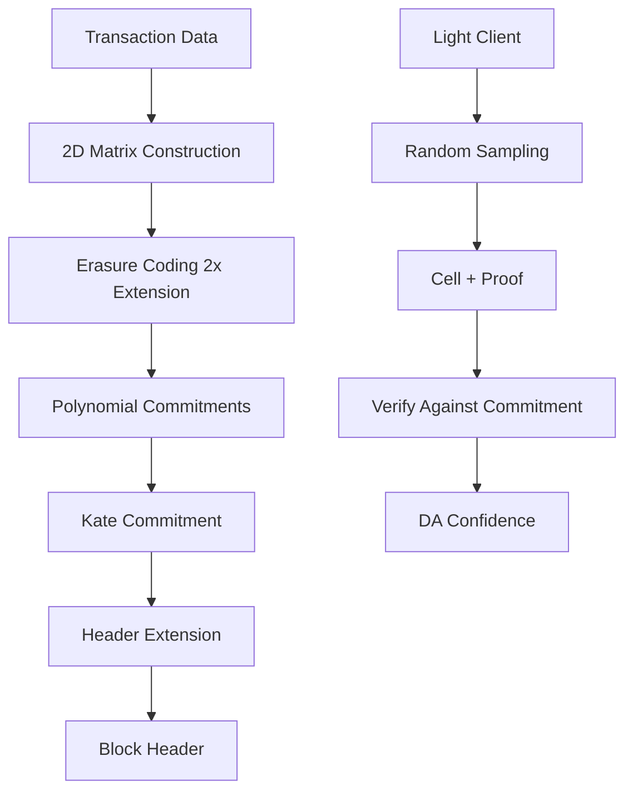

Avail's core innovation is its data availability layer built on Kate polynomial commitments (also known as KZG commitments). This enables light clients to verify data availability through efficient random sampling without downloading entire blocks.

## Overview

The data availability layer ensures that block data is available and can be retrieved, even if you don't download the entire block. This is critical for:

- **Rollups**: Publishing transaction data to Avail
- **Validiums**: Storing data off-chain with DA guarantees
- **Light Clients**: Verifying data availability without full nodes
- **Modular Blockchains**: Separating data availability from execution



## Data Matrix Construction

### Extrinsic to Matrix Transformation

Transactions are arranged into a 2D matrix for erasure coding (`runtime/src/kate/native.rs:27-54`):

<Steps>
  <Step title="Collect Extrinsics">
    Block author collects transactions from the mempool, tagged with their `AppId`.
  </Step>

  <Step title="Matrix Dimensions">
    Determine matrix size from `DynamicBlockLength`:
    
    ```rust
    let (max_width, max_height) = to_width_height(&block_length);
    // Default: 256 cols × 256 rows
    // Max: 1024 cols × 1024 rows
    ```
  </Step>

  <Step title="Arrange into Grid">
    Extrinsics are serialized and placed into the matrix cell-by-cell:
    
    ```rust runtime/src/kate/native.rs:39-41
    let grid = EGrid::from_extrinsics(
        submitted,
        MIN_WIDTH,     // Minimum 32
        max_width,     // Configured width
        max_height,    // Configured height
        seed           // Randomness for row assignments
    )?;
    ```
  </Step>

  <Step title="Erasure Coding Extension">
    The grid is extended by 2x in the column dimension:
    
    ```rust runtime/src/kate/native.rs:40-41
    .extend_columns(NonZeroU16::new(2).expect("2>0"))
    ```
    
    This creates redundancy - only 50% of cells are needed to reconstruct the full data.
  </Step>
</Steps>

### Cell Structure

Each cell in the matrix contains:

- **Original Cells**: Actual transaction data (first 50% of columns)
- **Extended Cells**: Erasure-coded redundancy (second 50% of columns)
- **Cell Size**: 31 bytes per cell (fits in a BLS12-381 scalar field element)

<Info>
The chunk size is 32 bytes, but only 31 bytes are used for data to ensure the value fits within the scalar field: `BLOCK_CHUNK_SIZE = 32`
</Info>

## Kate Polynomial Commitments

Kate commitments are KZG (Kate-Zaverucha-Goldberg) polynomial commitments over the BLS12-381 elliptic curve.

### How It Works

<Accordion title="Polynomial Commitment Basics">
  **Step 1: Interpolate Polynomial**
  
  Each row of the matrix is interpolated as a polynomial:
  ```
  row[0], row[1], ..., row[n-1] → polynomial P(x)
  ```
  
  **Step 2: Commit to Polynomial**
  
  Using a trusted setup SRS (Structured Reference String), compute:
  ```
  commitment = P(τ) · G
  ```
  where τ is a secret value from the trusted setup, and G is a generator point.
  
  **Step 3: Generate Proofs**
  
  For any cell at position i, create a proof:
  ```
  proof = (P(x) - P(i)) / (x - i) · G
  ```
  
  **Step 4: Verify**
  
  Anyone can verify that a cell value v is correct at position i:
  ```
  e(commitment - v·G, G) == e(proof, τ·G - i·G)
  ```
  using elliptic curve pairings.
</Accordion>

### Implementation

The Kate implementation uses the `kate` crate with runtime interfaces (`runtime/src/kate/native.rs`):

<CodeGroup>
```rust Proof Generation
fn proof(
    extrinsics: Vec<AppExtrinsic>,
    block_len: BlockLength,
    seed: Seed,
    cells: Vec<(u32, u32)>,  // (row, col) positions
) -> Result<Vec<GDataProof>, Error> {
    let srs = SRS.get_or_init(multiproof_params);
    let (max_width, max_height) = to_width_height(&block_len);
    
    // Build and extend grid
    let grid = EGrid::from_extrinsics(extrinsics, MIN_WIDTH, max_width, max_height, seed)?
        .extend_columns(NonZeroU16::new(2).expect("2>0"))?;
    
    // Create polynomial grid
    let poly = grid.make_polynomial_grid()?;
    
    // Generate proof for each cell
    let proofs = cells
        .into_par_iter()
        .map(|(row, col)| {
            let data = grid.get(row, col)?;
            let cell = Cell::new(BlockLengthRows(row), BlockLengthColumns(col));
            let proof = poly.proof(srs, &cell)?;
            Ok((data, proof))
        })
        .collect()?;
    
    Ok(proofs)
}
```

```rust Multiproof Generation
fn multiproof(
    extrinsics: Vec<AppExtrinsic>,
    block_len: BlockLength,
    seed: Seed,
    cells: Vec<(u32, u32)>,
) -> Result<Vec<(GMultiProof, GCellBlock)>, Error> {
    let target_dims = Dimensions::new(16, 64).expect("16,64>0");
    
    let proofs = cells
        .into_par_iter()
        .map(|(row, col)| {
            let cell = Cell::new(BlockLengthRows(row), BlockLengthColumns(col));
            let mp = poly.multiproof(srs, &cell, &grid, target_dims)?;
            
            let data = mp.evals.into_iter().flatten()
                .map(|e: ArkScalar| e.to_bytes().map(GRawScalar::from))
                .collect()?;
            
            let proof = mp.proof.to_bytes().map(GProof)?;
            Ok(((data, proof), GCellBlock::from(mp.block)))
        })
        .collect()?;
    
    Ok(proofs)
}
```
</CodeGroup>

### Proof Types

Avail supports two proof types:

<Tabs>
  <Tab title="Single Cell Proof">
    **GDataProof**: Proves a single cell's correctness
    
    ```rust runtime/src/kate/mod.rs:24
    pub type GDataProof = (GRawScalar, GProof);
    ```
    
    - **GRawScalar**: The 256-bit cell value (U256)
    - **GProof**: 48-byte KZG proof
    
    Used for: Point queries, light client sampling
  </Tab>

  <Tab title="Multiproof">
    **GMultiProof**: Proves multiple cells with a single proof
    
    ```rust runtime/src/kate/mod.rs:25
    pub type GMultiProof = (Vec<GRawScalar>, GProof);
    ```
    
    - **Vec\<GRawScalar\>**: Multiple cell values (16×64 = 1024 cells)
    - **GProof**: Single 48-byte proof for all cells
    - **GCellBlock**: Defines the rectangular block of cells
    
    Used for: Efficient bulk verification, downloading app-specific data
  </Tab>
</Tabs>

## Header Extension

The Kate commitment is stored in the block header extension (`avail_core::header::HeaderExtension`).

### Extension Builder

The runtime API builds header extensions (`runtime/src/apis.rs:49-60`):

```rust runtime/src/apis.rs
pub trait ExtensionBuilder {
    fn build_extension(
        extrinsics: Vec<OpaqueExtrinsic>,
        data_root: H256,
        block_length: BlockLength,
        block_number: u32,
    ) -> HeaderExtension;
    
    fn build_data_root(
        block: u32,
        extrinsics: Vec<OpaqueExtrinsic>
    ) -> H256;
}
```

### Extension Contents

The `HeaderExtension` contains:

1. **Commitments**: Kate commitments for each row
2. **Data Root**: Merkle root of all extrinsics
3. **Dimensions**: Matrix rows and columns
4. **App Lookup**: Mapping of AppId to row ranges

<Note>
The header extension is verified during block import (`node/src/da_block_import.rs:81-111`), ensuring blocks without valid commitments are rejected.
</Note>

## Data Availability Sampling

Light clients perform **Data Availability Sampling (DAS)** to gain confidence that data is available:

### Sampling Process

<Steps>
  <Step title="Random Cell Selection">
    Light client randomly selects N cells from the extended matrix (e.g., 16 cells).
  </Step>

  <Step title="Request Cells + Proofs">
    Queries full nodes for the selected cells and their Kate proofs.
  </Step>

  <Step title="Verify Proofs">
    Verifies each proof against the commitment in the block header:
    
    ```
    verify(commitment, cell_position, cell_value, proof) == true
    ```
  </Step>

  <Step title="Calculate Confidence">
    With k successful samples, confidence that >50% of data is available:
    
    ```
    confidence = 1 - (0.5)^k
    ```
    
    - 16 samples: 99.998% confidence
    - 20 samples: 99.9999% confidence
  </Step>
</Steps>

### Reconstruction Guarantee

Due to 2x erasure coding:
- If >50% of cells are available, the full block can be reconstructed
- Light clients gain high confidence with just a few samples
- No need to download the entire block

<Info>
**Example**: A 256×512 matrix has 131,072 cells. A light client only needs to sample ~20 cells (0.015% of the block) to achieve 99.9999% confidence that the block is available.
</Info>

## Application-Specific Data Retrieval

Avail supports multiple applications submitting data to the same block, each identified by an `AppId`.

### AppId System

Applications register keys through the `da_control` pallet (`pallets/dactr/src/lib.rs:158-178`):

```rust
pub fn create_application_key(
    origin: OriginFor<T>,
    key: AppKeyFor<T>,
) -> DispatchResultWithPostInfo {
    let owner = ensure_signed(origin)?;
    ensure!(!key.is_empty(), Error::<T>::AppKeyCannotBeEmpty);
    
    let id = AppKeys::<T>::try_mutate(&key, |key_info| {
        ensure!(key_info.is_none(), Error::<T>::AppKeyAlreadyExists);
        
        let id = Self::next_application_id()?;
        *key_info = Some(AppKeyInfo { id, owner: owner.clone() });
        Ok(id)
    })?;
    
    Self::deposit_event(Event::ApplicationKeyCreated { key, owner, id });
    Ok(().into())
}
```

### Data Submission

Applications submit data with an implicit or explicit AppId:

```rust pallets/dactr/src/lib.rs:186-200
pub fn submit_data(
    origin: OriginFor<T>,
    data: AppDataFor<T>,  // Up to 1 MB
) -> DispatchResultWithPostInfo {
    let who = ensure_signed(origin)?;
    ensure!(!data.is_empty(), Error::<T>::DataCannotBeEmpty);
    
    let data_hash = blake2_256(&data);
    Self::deposit_event(Event::DataSubmitted {
        who,
        data_hash: H256(data_hash),
    });
    
    Ok(().into())
}
```

The `CheckAppId` extension extracts the AppId from the transaction for matrix placement.

### App Data Retrieval

Clients can retrieve only their application's data using the Kate API (`runtime/src/kate/native.rs:141-168`):

```rust
fn app_data(
    submitted: Vec<AppExtrinsic>,
    block_length: BlockLength,
    seed: Seed,
    app_id: u32,
) -> Result<Vec<Option<GRow>>, Error> {
    let grid = EGrid::from_extrinsics(submitted, MIN_WIDTH, max_width, max_height, seed)?;
    
    let dims = grid.dims();
    let Some(rows) = grid.app_rows(AppId(app_id), Some(dims))? else {
        return Err(Error::AppRow);
    };
    
    // Return only rows containing app_id data
    let mut all_rows = vec![None; dims.height()];
    for (row_y, row) in rows {
        let g_row = row.into_par_iter()
            .map(|s| s.to_bytes().map(GRawScalar::from))
            .collect()?;
        all_rows[row_y] = Some(g_row);
    }
    
    Ok(all_rows)
}
```

This allows applications to:
- Download only their own data rows
- Avoid downloading unrelated application data
- Verify data integrity with Kate proofs

## Block Length Dynamics

The matrix dimensions can be adjusted via governance (`pallets/dactr/src/lib.rs:204-254`):

```rust
pub fn submit_block_length_proposal(
    origin: OriginFor<T>,
    rows: u32,
    cols: u32,
) -> DispatchResultWithPostInfo {
    ensure_root(origin)?;
    
    // Validate dimensions
    ensure!(
        rows <= MaxBlockRows && cols <= MaxBlockCols,
        Error::<T>::BlockDimensionsOutOfBounds
    );
    ensure!(
        rows >= MinBlockRows && cols >= MinBlockCols,
        Error::<T>::BlockDimensionsTooSmall
    );
    
    // Must be powers of 2
    ensure!(rows.is_power_of_two(), Error::<T>::NotPowerOfTwo);
    ensure!(cols.is_power_of_two(), Error::<T>::NotPowerOfTwo);
    
    // Update block dimensions
    let block_length = BlockLength::with_normal_ratio(
        BlockLengthRows(rows),
        BlockLengthColumns(cols),
        BLOCK_CHUNK_SIZE,
        DA_DISPATCH_RATIO_PERBILL,
    )?;
    
    DynamicBlockLength::<T>::put(block_length);
    
    Self::deposit_event(Event::BlockLengthProposalSubmitted { rows, cols });
    Ok(().into())
}
```

### Dimension Constraints

<CodeGroup>
```rust Minimum Dimensions
MinBlockRows = 32
MinBlockCols = 32
// Minimum block: 32 KB (before erasure coding)
```

```rust Maximum Dimensions
MaxBlockRows = 1024
MaxBlockCols = 1024
// Maximum block: 32 MB (before erasure coding)
// After 2x extension: 64 MB
```

```rust Default Dimensions
rows = 256
cols = 256
// Default block: 2 MB (before extension)
// After 2x extension: 4 MB
```
</CodeGroup>

<Warning>
Dimensions must be powers of 2 for efficient FFT (Fast Fourier Transform) operations during polynomial interpolation.
</Warning>

## Data Root Calculation

In addition to Kate commitments, Avail computes a **data root** - a Merkle root of all extrinsics.

This provides:
- Fast inclusion proofs for specific transactions
- Compatibility with standard Merkle proof systems
- Additional data integrity verification

```rust
fn build_data_root(
    block: u32,
    extrinsics: Vec<OpaqueExtrinsic>
) -> H256;
```

## Security Guarantees

### Data Availability Guarantee

<CardGroup cols={2}>
  <Card title="Honest Majority" icon="users">
    As long as >50% of validators are honest, data availability is guaranteed
  </Card>
  <Card title="Erasure Coding" icon="shield">
    50% of cells are sufficient to reconstruct the full block
  </Card>
  <Card title="Cryptographic Proofs" icon="key">
    Kate proofs are cryptographically binding and verifiable
  </Card>
  <Card title="Sampling Confidence" icon="chart-line">
    Light clients achieve >99.99% confidence with minimal samples
  </Card>
</CardGroup>

### Attack Resistance

<Accordion title="Block Withholding Attack">
  **Attack**: Block producer creates invalid erasure coding or withholds data
  
  **Defense**:
  1. Header extension verification during block import ensures valid commitments
  2. Light clients detect unavailable data through sampling failures
  3. Validators download and verify random cells before voting
  4. Invalid blocks are rejected by GRANDPA consensus
</Accordion>

<Accordion title="Data Withholding After Finality">
  **Attack**: Validators finalize a block, then all collude to delete data
  
  **Defense**:
  1. Honest minority (even 1 node) can store and redistribute full block
  2. Economic incentives: archival nodes earn fees for serving data
  3. Redundancy: 2x erasure coding means multiple copies exist
  4. Slashing: Provable data unavailability results in validator slashing
</Accordion>

## Performance Characteristics

### Proof Generation

- **Single Proof**: ~1-5ms per cell (parallel generation)
- **Multiproof (1024 cells)**: ~50-100ms
- **Full Block Commitment**: ~100-500ms depending on size

### Proof Size

- **Single Proof**: 48 bytes (constant)
- **Multiproof**: 48 bytes + (32 bytes × number of cells)
- **Header Extension**: ~10-50 KB depending on block size

### Verification

- **Single Proof Verification**: ~2-10ms
- **Multiproof Verification**: ~5-15ms (amortized cost)
- **Light Client Sampling (20 cells)**: ~50-200ms total

## RPC API for Data Availability

The Kate RPC provides access to DA proofs (`runtime/src/apis.rs:68-73`):

```rust
pub trait KateApi {
    // Get proof for specific transaction
    fn data_proof(
        block_number: u32,
        extrinsics: Vec<OpaqueExtrinsic>,
        tx_idx: u32
    ) -> Option<ProofResponse>;
    
    // Get specific rows
    fn rows(
        block_number: u32,
        extrinsics: Vec<OpaqueExtrinsic>,
        block_len: BlockLength,
        rows: Vec<u32>
    ) -> Result<Vec<GRow>, Error>;
    
    // Get proofs for specific cells
    fn proof(
        block_number: u32,
        extrinsics: Vec<OpaqueExtrinsic>,
        block_len: BlockLength,
        cells: Vec<(u32, u32)>
    ) -> Result<Vec<GDataProof>, Error>;
    
    // Get multiproofs for cell blocks
    fn multiproof(
        block_number: u32,
        extrinsics: Vec<OpaqueExtrinsic>,
        block_len: BlockLength,
        cells: Vec<(u32, u32)>
    ) -> Result<Vec<(GMultiProof, GCellBlock)>, Error>;
}
```

Enable Kate RPC with the `--enable-kate-rpc` flag.

## Next Steps

<CardGroup cols={2}>
  <Card title="Architecture Overview" icon="diagram-project" href="/architecture/overview">
    Understanding the overall system architecture
  </Card>
  <Card title="Runtime Architecture" icon="cube" href="/architecture/runtime">
    Deep dive into runtime pallets
  </Card>
  <Card title="Consensus" icon="gears" href="/architecture/consensus">
    Learn about BABE and GRANDPA
  </Card>
</CardGroup>