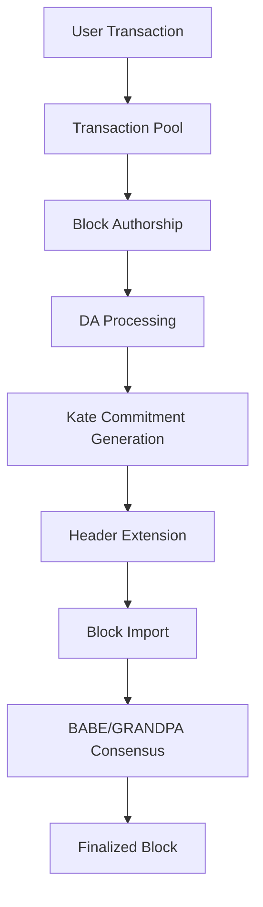

Avail is a modular blockchain built on Substrate that provides data availability guarantees through Kate polynomial commitments. The node architecture consists of several key components working together to enable scalable data availability.

## Core Components

The Avail node is structured around these primary architectural layers:

### Runtime Layer

The runtime (`runtime/src/lib.rs:103-153`) is composed of specialized pallets that handle different aspects of blockchain functionality:

- **Consensus Pallets**: BABE (block production) and GRANDPA (finality)
- **Core Substrate Pallets**: System, Balances, Transaction Payment, Staking
- **Data Availability**: `da_control` pallet for managing DA operations
- **Governance & Utility**: Mandate, Vector, Identity, Proxy, TxPause
- **Economic Pallets**: Treasury, NominationPools, ElectionProviderMultiPhase

### Node Layer

The node implementation (`node/src/`) provides:

- **Block Import**: Custom DA block import verification (`da_block_import.rs:29-168`)
- **RPC Services**: JSON-RPC endpoints for interacting with the chain
- **Network Layer**: P2P communication and chain synchronization
- **Service Orchestration**: Consensus, block authoring, and finalization services

### Base Layer

The base module (`base/src/`) contains infrastructure for:

- **Header Extensions**: Data structures for Kate commitments (`header_extension/`)
- **Metrics**: Avail-specific monitoring and observability
- **Memory Storage**: Temporary storage mechanisms for DA operations
- **Post-Inherents**: Transaction processing hooks

## Data Flow



<Steps>
  <Step title="Transaction Submission">
    Users submit transactions through the `da_control::submit_data` extrinsic, which accepts arbitrary data payloads up to 1 MB.
  </Step>
  
  <Step title="Block Construction">
    The block author collects transactions and arranges them into a 2D matrix structure for Kate commitment generation.
  </Step>
  
  <Step title="Kate Commitment">
    The runtime generates polynomial commitments over the data matrix, creating erasure-coded proofs for data availability.
  </Step>
  
  <Step title="Block Verification">
    The DA block import layer (`da_block_import.rs:126-148`) verifies that header extensions match the calculated Kate commitments before passing blocks to consensus.
  </Step>
</Steps>

## Key Design Principles

### Modular Data Availability

Avail separates data availability from execution. The chain stores and guarantees data availability without executing application-specific logic on that data.

### Polynomial Commitments

Kate polynomial commitments enable:
- Efficient data availability sampling
- Compact proofs for arbitrary data segments
- Light client verification without downloading full blocks

### Application-Specific Data

The `AppId` system (`runtime/src/lib.rs:42`) allows multiple applications to use Avail for DA, with each transaction tagged to a specific application.

## Runtime Configuration

<CodeGroup>
```rust runtime/src/lib.rs
construct_runtime!(
    pub struct Runtime
    {
        System: frame_system = 0,
        Babe: pallet_babe = 2,
        Timestamp: pallet_timestamp = 3,
        Balances: pallet_balances = 6,
        TransactionPayment: pallet_transaction_payment = 7,
        
        Staking: pallet_staking = 10,
        Session: pallet_session = 11,
        Grandpa: pallet_grandpa = 17,
        
        // Data Availability
        DataAvailability: da_control = 29,
        
        // Avail-specific pallets
        Mandate: pallet_mandate = 38,
        Vector: pallet_vector = 39,
        // ... more pallets
    }
)
```
</CodeGroup>

## Component Interactions

### Block Production Pipeline

1. **Transaction Collection**: Transactions are collected from the mempool
2. **Data Matrix Construction**: Transactions are arranged into rows and columns
3. **Erasure Coding**: Kate commitments are generated with 2x extension
4. **Header Extension**: Commitments are embedded in the block header
5. **Consensus**: BABE produces blocks, GRANDPA finalizes them

### Verification Pipeline

1. **Header Extension Validation**: Custom block import checks Kate commitments
2. **Data Root Calculation**: Runtime API builds data root from extrinsics
3. **Extension Comparison**: Imported extension must match calculated extension
4. **Post-Inherent Check**: Ensures required inherents are present

<Note>
The DA block import layer (`node/src/da_block_import.rs`) ensures that only blocks with valid Kate commitments can be imported, providing cryptographic guarantees of data availability.
</Note>

## Storage Architecture

Avail uses a combination of storage mechanisms:

- **On-chain Storage**: Block headers with Kate commitments
- **Block Body Storage**: Full transaction data in the node database
- **State Storage**: Runtime state in a Merkle-Patricia trie
- **MMR (Merkle Mountain Range)**: For efficient historical proof generation

## API Layers

The runtime exposes multiple API surfaces (`runtime/src/apis.rs`):

- **DataAvailApi**: Query block length parameters
- **ExtensionBuilder**: Build and verify header extensions
- **KateApi**: Generate data proofs and retrieve specific rows/cells
- **VectorApi**: Ethereum light client bridge functionality

<Info>
The modular architecture allows Avail to scale data availability independently of execution, making it suitable for rollup and validium use cases.
</Info>

## Next Steps

<CardGroup cols={2}>
  <Card title="Runtime Architecture" icon="cube" href="/architecture/runtime">
    Deep dive into runtime pallets and transaction processing
  </Card>
  <Card title="Consensus Mechanisms" icon="gears" href="/architecture/consensus">
    Learn about BABE and GRANDPA consensus
  </Card>
  <Card title="Data Availability" icon="database" href="/architecture/data-availability">
    Explore Kate commitments and DA guarantees
  </Card>
</CardGroup>