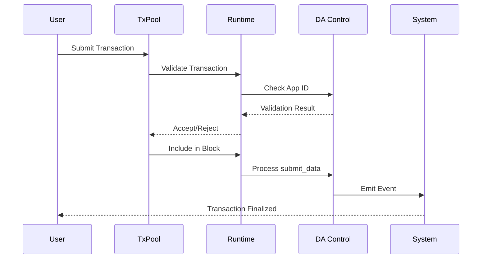

The Avail runtime is built using Substrate's FRAME framework, composing multiple pallets that each handle specific functionality. The runtime is compiled to WebAssembly and executes on-chain, providing deterministic state transitions.

## Runtime Composition

The Avail runtime (`runtime/src/lib.rs:103-153`) consists of 20+ pallets organized into functional categories:

### Core Pallets

<AccordionGroup>
  <Accordion title="System & Utility Pallets">
    - **System** (index 0): Core blockchain functionality, block management
    - **Utility** (index 1): Batch transactions and multi-signature operations
    - **Timestamp** (index 3): Block timestamp management
    - **Indices** (index 5): Account index lookup system
    - **Multisig** (index 34): Multi-signature account operations
    - **Proxy** (index 40): Proxy account delegation
  </Accordion>

  <Accordion title="Consensus & Block Production">
    - **Babe** (index 2): Block production using BABE (Blind Assignment for Blockchain Extension)
    - **Grandpa** (index 17): Block finality using GRANDPA consensus
    - **Authorship** (index 4): Block authorship tracking and uncle rewards
    - **ImOnline** (index 20): Validator heartbeat mechanism
    - **AuthorityDiscovery** (index 21): P2P authority node discovery
  </Accordion>

  <Accordion title="Economic & Governance">
    - **Balances** (index 6): Account balances and transfers
    - **TransactionPayment** (index 7): Transaction fee calculation and payment
    - **Staking** (index 10): Proof-of-Stake validator economics
    - **Session** (index 11): Validator session management
    - **Treasury** (index 18): On-chain treasury for protocol funds
    - **NominationPools** (index 36): Pooled staking for nominators
  </Accordion>

  <Accordion title="Data Availability">
    - **DataAvailability (da_control)** (index 29): Core DA functionality, application keys, data submission
    - **Mmr** (index 27): Merkle Mountain Range for efficient proofs
    - **Preimage** (index 33): Storage for large preimages
  </Accordion>

  <Accordion title="Avail-Specific Features">
    - **Vector** (index 39): Ethereum light client bridge integration
    - **Mandate** (index 38): Technical committee privileged calls
    - **Identity** (index 37): On-chain identity management
    - **TxPause** (index 41): Circuit breaker for pausing transactions
  </Accordion>
</AccordionGroup>

## Transaction Flow



### Transaction Processing Pipeline

<Steps>
  <Step title="Pre-Validation">
    Transaction is decoded and basic checks are performed (signature, nonce, payment).
    
    ```rust
    // Transaction validation in runtime
    fn validate_transaction(
        source: TransactionSource,
        tx: <Block as BlockT>::Extrinsic,
    ) -> TransactionValidity
    ```
  </Step>

  <Step title="Application ID Check">
    The `CheckAppId` extension (`pallets/dactr/src/extensions/check_app_id.rs`) validates that the AppId exists if specified.
  </Step>

  <Step title="Fee Calculation">
    TransactionPayment pallet calculates fees based on:
    - Extrinsic weight
    - Data length
    - Dynamic fee multiplier
    - For `submit_data`: special weight calculation based on matrix space
    
    See `da_control::weight_helper::submit_data` (`pallets/dactr/src/lib.rs:416-463`)
  </Step>

  <Step title="Execution">
    The pallet's dispatchable function executes, modifying runtime state.
  </Step>

  <Step title="Event Emission">
    Events are emitted to the event log for indexing and monitoring.
  </Step>
</Steps>

## Data Availability Pallet

The `da_control` pallet (`pallets/dactr/src/lib.rs`) is the core of Avail's data availability functionality.

### Key Data Structures

<CodeGroup>
```rust Application Key Info
#[derive(Clone, Encode, Decode, TypeInfo, PartialEq, RuntimeDebug)]
pub struct AppKeyInfo<Acc: PartialEq> {
    /// Owner of the key
    pub owner: Acc,
    /// Application ID associated
    pub id: AppId,
}
```

```rust Storage Items
// Last application ID
pub type NextAppId<T: Config> = StorageValue<_, AppId, ValueQuery>;

// Store all application keys
pub type AppKeys<T: Config> = StorageMap<_, Blake2_128Concat, AppKeyFor<T>, AppKeyInfoFor<T>>;

// Data fee modifier for submit_data call
pub type SubmitDataFeeModifier<T: Config> = StorageValue<_, DispatchFeeModifier, ValueQuery>;
```
</CodeGroup>

### Dispatchable Functions

<Tabs>
  <Tab title="create_application_key">
    Creates a new application key and assigns an AppId.
    
    ```rust pallets/dactr/src/lib.rs:158-178
    pub fn create_application_key(
        origin: OriginFor<T>,
        key: AppKeyFor<T>,
    ) -> DispatchResultWithPostInfo
    ```
    
    - Ensures key doesn't already exist
    - Increments NextAppId
    - Stores key-to-AppId mapping
    - Emits `ApplicationKeyCreated` event
  </Tab>

  <Tab title="submit_data">
    Submits data to the Avail blockchain for data availability.
    
    ```rust pallets/dactr/src/lib.rs:186-200
    pub fn submit_data(
        origin: OriginFor<T>,
        data: AppDataFor<T>,  // Up to 1 MB
    ) -> DispatchResultWithPostInfo
    ```
    
    - Accepts data up to `MaxAppDataLength` (1,048,576 bytes)
    - Hashes data with Blake2-256
    - Emits `DataSubmitted` event with hash
    - Uses custom weight calculation based on matrix space consumption
  </Tab>

  <Tab title="submit_block_length_proposal">
    Admin function to adjust block matrix dimensions.
    
    ```rust pallets/dactr/src/lib.rs:204-254
    pub fn submit_block_length_proposal(
        origin: OriginFor<T>,
        rows: u32,
        cols: u32,
    ) -> DispatchResultWithPostInfo
    ```
    
    - Requires root origin
    - Validates dimensions are powers of 2
    - Updates `DynamicBlockLength` configuration
    - Affects data matrix size for subsequent blocks
  </Tab>

  <Tab title="set_submit_data_fee_modifier">
    Adjusts the fee multiplier for data submission.
    
    ```rust pallets/dactr/src/lib.rs:291-302
    pub fn set_submit_data_fee_modifier(
        origin: OriginFor<T>,
        modifier: DispatchFeeModifier,
    ) -> DispatchResultWithPostInfo
    ```
    
    Allows dynamic fee adjustment based on network conditions.
  </Tab>
</Tabs>

## Weight Calculation for Data Submission

Avail uses a sophisticated weight model for `submit_data` that accounts for data availability matrix space:

```rust pallets/dactr/src/lib.rs:421-463
pub fn submit_data<T: Config>(data_len: usize) -> Weight {
    // Calculate data size with SCALE encoding prefix
    let encoded_data_len = data_len + compact_len(&data_len);
    
    // Get current matrix dimensions
    let cols = current_block_dimension.cols.0;
    let rows = current_block_dimension.rows.0;
    
    // Calculate max scalars with DA ratio (90%)
    let max_scalar_da_ratio = DA_DISPATCH_RATIO_PERBILL * cols * rows;
    
    // Compute number of 31-byte scalars needed
    let nb_scalar = encoded_data_len / (BLOCK_CHUNK_SIZE - 1);
    
    // Weight proportional to matrix space used
    let data_scalar_ratio = nb_scalar / max_scalar_da_ratio;
    let weight = data_scalar_ratio * max_weight_normal_ratio;
    
    return max(weight, basic_weight);
}
```

<Note>
This weight model ensures that transactions consuming more matrix space pay proportionally higher fees, preventing block space spam.
</Note>

## Vector Pallet (Ethereum Bridge)

The Vector pallet (`pallets/vector/src/lib.rs`) implements an Ethereum light client bridge using zero-knowledge proofs.

### Key Features

- **Light Client Verification**: Verifies Ethereum consensus using SP1 Groth16 proofs
- **Message Passing**: Enables cross-chain messaging between Avail and Ethereum
- **Sync Committee Tracking**: Maintains Ethereum beacon chain sync committee state

```rust pallets/vector/src/lib.rs:35-48
sol! {
    struct ProofOutputs {
        bytes32 executionStateRoot;
        bytes32 newHeader;
        bytes32 nextSyncCommitteeHash;
        uint256 newHead;
        bytes32 prevHeader;
        uint256 prevHead;
        bytes32 syncCommitteeHash;
        bytes32 startSyncCommitteeHash;
    }
}
```

## Mandate Pallet

The Mandate pallet (`pallets/mandate/src/lib.rs`) provides a governance mechanism for the Technical Committee to execute privileged operations.

```rust pallets/mandate/src/lib.rs:55-68
pub fn mandate(
    origin: OriginFor<T>,
    call: Box<<T as Config>::RuntimeCall>,
) -> DispatchResultWithPostInfo {
    T::ApprovedOrigin::ensure_origin(origin)?;
    
    // Execute call with Root origin
    let res = call.dispatch_bypass_filter(frame_system::RawOrigin::Root.into());
    
    Self::deposit_event(Event::RootOp {
        result: res.map(|_| ()).map_err(|e| e.error),
    });
    
    Ok(Pays::No.into())  // No fee for mandate calls
}
```

## Runtime APIs

The runtime exposes several custom APIs for client-side operations (`runtime/src/apis.rs:43-74`):

<CardGroup cols={2}>
  <Card title="DataAvailApi" icon="chart-simple">
    ```rust
    fn block_length() -> BlockLength;
    ```
    Returns current block matrix dimensions.
  </Card>

  <Card title="ExtensionBuilder" icon="hammer">
    ```rust
    fn build_extension(...) -> HeaderExtension;
    fn build_data_root(...) -> H256;
    fn check_if_extrinsic_is_post_inherent(...) -> bool;
    ```
    Builds Kate commitments and validates block structure.
  </Card>

  <Card title="KateApi" icon="key">
    ```rust
    fn data_proof(...) -> Option<ProofResponse>;
    fn rows(...) -> Result<Vec<GRow>, Error>;
    fn proof(...) -> Result<Vec<GDataProof>, Error>;
    fn multiproof(...) -> Result<Vec<(GMultiProof, GCellBlock)>, Error>;
    ```
    Generates data availability proofs.
  </Card>

  <Card title="VectorApi" icon="bridge">
    ```rust
    fn sync_committee_poseidons(slot: u64) -> U256;
    fn head() -> u64;
    fn headers(slot: u64) -> H256;
    ```
    Queries Ethereum light client state.
  </Card>
</CardGroup>

## Configuration Parameters

Key runtime parameters defined in `runtime/src/constants.rs` and `runtime/src/impls.rs`:

```rust
// Block time
pub const SLOT_DURATION: u64 = 20_000; // 20 seconds
pub const EPOCH_DURATION_IN_BLOCKS: BlockNumber = 4 * HOURS;

// Data Availability
pub const MinBlockRows: BlockLengthRows = BlockLengthRows(32);
pub const MaxBlockRows: BlockLengthRows = BlockLengthRows(1024);
pub const MinBlockCols: BlockLengthColumns = BlockLengthColumns(32);
pub const MaxBlockCols: BlockLengthColumns = BlockLengthColumns(1024);
pub const MaxAppDataLength: u32 = 1_048_576; // 1 MB

// Dispatch ratios
pub const DA_DISPATCH_RATIO: u8 = 90; // 90% for DA
pub const NORMAL_DISPATCH_RATIO: u8 = 100; // 100% for normal txs
```

## Call Size Constraints

The runtime enforces strict size limits on calls to prevent DoS (`runtime/src/lib.rs:326-343`):

```rust
const RUNTIME_CALL_SIZE: usize = 208;
const DA_CALL_SIZE: usize = 64;
const SYSTEM_CALL_SIZE: usize = 40;
```

Large arguments should use `Box<T>` to keep enum variants small.

<Warning>
If adding new dispatchable functions with large parameters, use `Box<T>` to avoid increasing the overall `RuntimeCall` size beyond 208 bytes.
</Warning>

## Next Steps

<CardGroup cols={2}>
  <Card title="Consensus" icon="gears" href="/architecture/consensus">
    Learn how BABE and GRANDPA work together
  </Card>
  <Card title="Data Availability" icon="database" href="/architecture/data-availability">
    Deep dive into Kate commitments
  </Card>
</CardGroup>